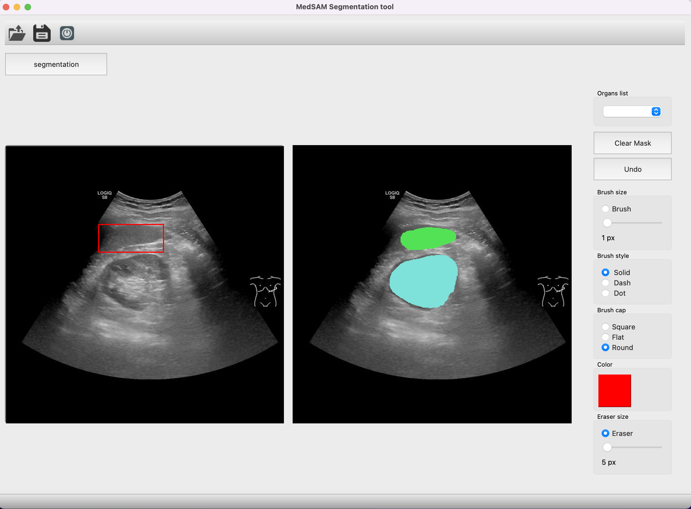

# SAM-based Annotation Tool

A key challenge in the field of medical image analysis is the scarcity of annotated data required to train deep-learning models. These models require extensive amounts of annotated data for training. Generating such large datasets needs skilled clinicians to manually annotate each image at the pixel level, which is time-consuming and labor-intensive. To address this challenge, deep learning models trained on medical images, such as MedSAM, can be employed to assist in the annotation process. To streamline this procedure, we developed a custom annotation tool using the PyQT library in Python. This tool is designed to simplify the annotation process and improve the efficiency of creating labeled datasets.
This tool enables users to upload ultrasound images and draw a rectangle around the region of interest. They can then apply the MedSAM segmentation model to generate a mask for the selected region. In case of any errors or noise, users have the option to refine the mask using a brush or eraser tool. Once the mask is refined, users can highlight the region to assign an appropriate label and save both the mask and the corresponding organ-level labels.

Reference: Ma J, He Y, Li F, Han L, You C, Wang B. Segment anything in medical images. Nat Commun. 2024 Jan;15(1):1234-1238. doi: 10.1038/s41467-024-44824-z.

